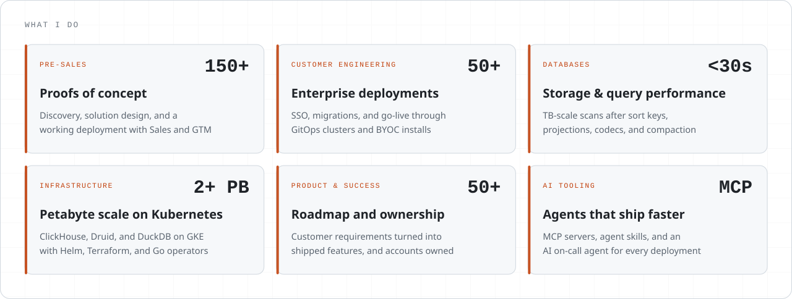
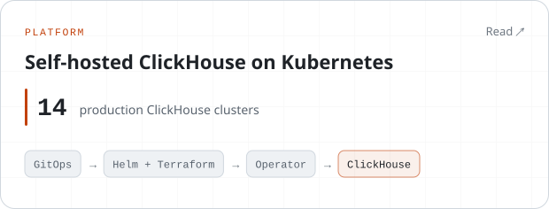
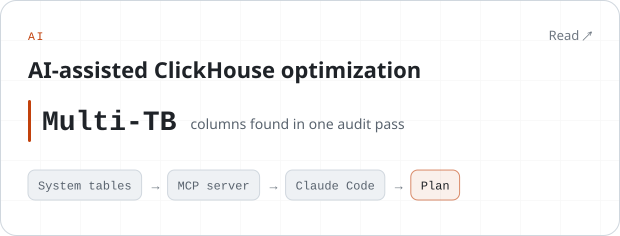
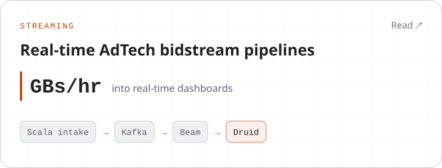
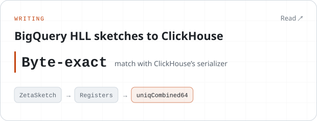
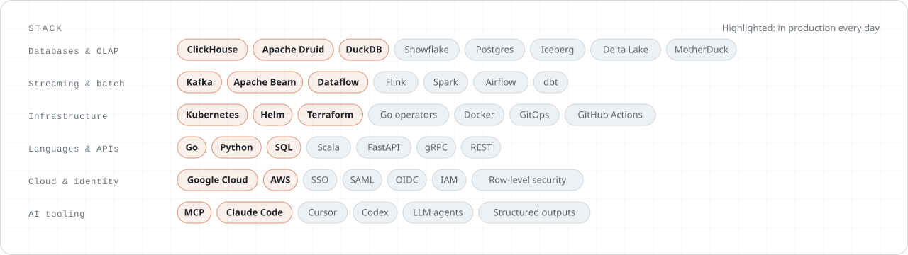

  
  
  
  
  

I'm a Forward Deployed Engineer at [Rill Data](https://www.rilldata.com), and one of its earliest engineers. I take enterprise AdTech and marketing-analytics customers from a proof of concept to production, and I run the ClickHouse, Apache Druid, and DuckDB fleet underneath them.

<picture><source media="(prefers-color-scheme: dark)" srcset="assets/capabilities-dark.svg"></picture>

### Selected work

<a href="https://rohithreddykota.com/projects/self-hosted-clickhouse-platform-kubernetes/"><picture><source media="(prefers-color-scheme: dark)" srcset="assets/study-clickhouse-k8s-dark.svg"></picture></a>
<a href="https://rohithreddykota.com/projects/ai-clickhouse-optimization-mcp/"><picture><source media="(prefers-color-scheme: dark)" srcset="assets/study-mcp-optimization-dark.svg"></picture></a>
<a href="https://rohithreddykota.com/projects/real-time-adtech-bidstream-pipelines/"><picture><source media="(prefers-color-scheme: dark)" srcset="assets/study-bidstream-dark.svg"></picture></a>
<a href="https://rohithreddykota.com/blog/bigquery-hll-sketches-to-clickhouse-uniqcombined64/"><picture><source media="(prefers-color-scheme: dark)" srcset="assets/study-hll-sketches-dark.svg"></picture></a>

All <a href="https://rohithreddykota.com/projects/">11 case studies</a> are on my site, each with the problem, what I built, the impact, and the stack.

<picture><source media="(prefers-color-scheme: dark)" srcset="assets/stack-dark.svg"></picture>

### Latest writing

<!-- BLOG-POST-LIST:START -->
- [Moving HyperLogLog sketches from BigQuery to ClickHouse without the raw data](https://rohithreddykota.com/blog/bigquery-hll-sketches-to-clickhouse-uniqcombined64/)
<!-- BLOG-POST-LIST:END -->

### Open source

- [**rilldata/rill**](https://github.com/rilldata/rill): open-source, real-time operational BI on ClickHouse, Druid, and DuckDB. Early engineer and contributor.
- [**rill-agent-skills**](https://github.com/rohithreddykota/rill-agent-skills): agent skills for developing Rill projects with Claude Code and Cursor. Install with `npx skills add rohithreddykota/rill-agent-skills`.

<b>GitHub activity</b>

 

More about me, my work, and my writing at <a href="https://rohithreddykota.com">rohithreddykota.com</a>

